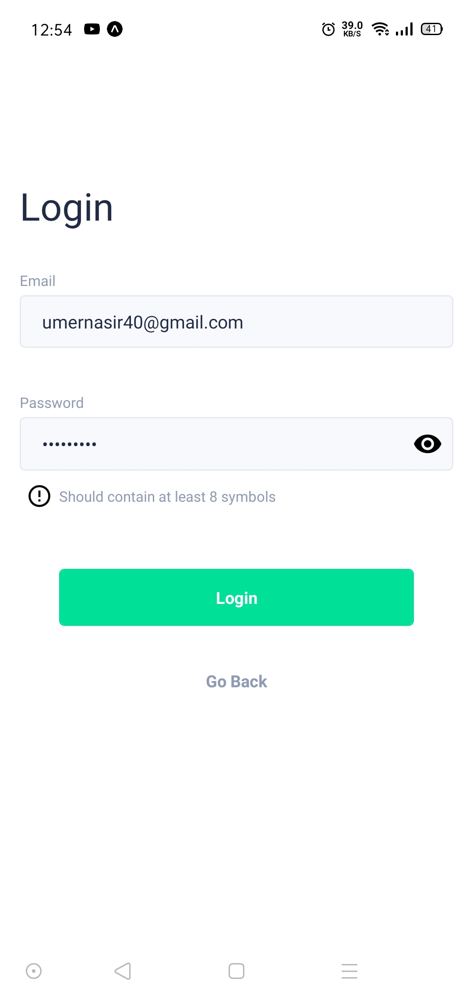

# HomePlantation

A platform to decorate your own home with beautiful flowers and plant decorations. 


<br/>
<br/>


# Technologies Used 

- React Native
- React Native Paper
- React Hooks
- React Navigation v5
- Axios
- Material Design

# Run Instructions

## Before Running

```bash
git clone https://github.com/Umernasirr/PlantApp-RN.git
cd PlantApp-RN
```

## Install Dependies 

```bash
npm install 
```

## To Run the application

After navigating to the base directory

```bash
expo start
```

# Screenshots

### The front screen of the user after logging into the application


<br/>
<br/>

### Settings of the user currently logged in


<br/>
<br/>

### The Authentication screen to signin / login to existing account 


<br/>
<br/>
